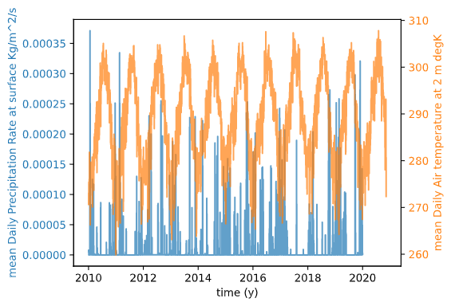
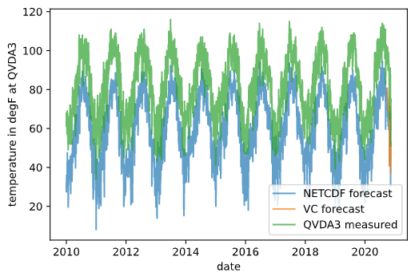

# Submission HW12
Quinn Hull
11/16/2020

## Contents
For homework 12, there are three files, including:
  1. This readme (Hull_HW12.md)
  2. A function python script (Hull_HW12_fxns.py)
  3. The main script for this week (Hull_HW.py)

### Assignment
  1. A brief description of how to generate forecasts
    I trained my two-week forecast model on flow data at the gage and temperature and precip data from QVDA3. I used forecasts from visual crossing for precip and temperature to generate my two week forecasts.

      The model is like this [flow_now] = B + B1x[flow_last] + B2x[temp_now] + B3X[precip_now]

    Another cool note is that I used the scaler function from skLearn MinMaxScale() to try to 'normalize' the data so as to create a better fit for our regression data

    I did not include precip and temperature data in my semester regression, but still normalized the data

  2.  A description of the dataset you added, plus figures
    I probably violated the assumptions of the assignment a little bit, honestly. I followed the steps outlined in both starter codes to download and and analyze precipitation and temperature history and 14 day forecasts. The historical trends at lat / long =  `[35.2375, 247.5]` are shown below.

      

    I didn't use either NETCDF in my forecast because I could only find very coarsely-gridded datasets (i.e., both the resulting datasets were for a lat / long location more than half a degree away from our study site on the Verde River) `[-111.7892, 34.4483]`. As a result, I didn't get very good matching between the temperature trends (for example) at the Verde River and those that were projected. (We know about the temperature and precip history at Verde River from site QVDA3 via mesonet). Instead, I used a dataset downloaded forecast and historical 'modeled' data from visualcrossing.com for the location of the QVDA3 site, which seemed to match the reality of QVDA3 better. Shown below.

      

    I used the two week forecast data from Sunday (11/15) to in my two week forecast model.

    The visualcrossing dataset is a simple web-based data access channel to import weather history and forecasts. It's geared to business. It can be accessed via API / JSON, or simple API. It's well-documented about the source, support, and usage [here](https://www.visualcrossing.com/resources/documentation/weather-data/weather-data-documentation/). Behind paywall after 200 queries.
