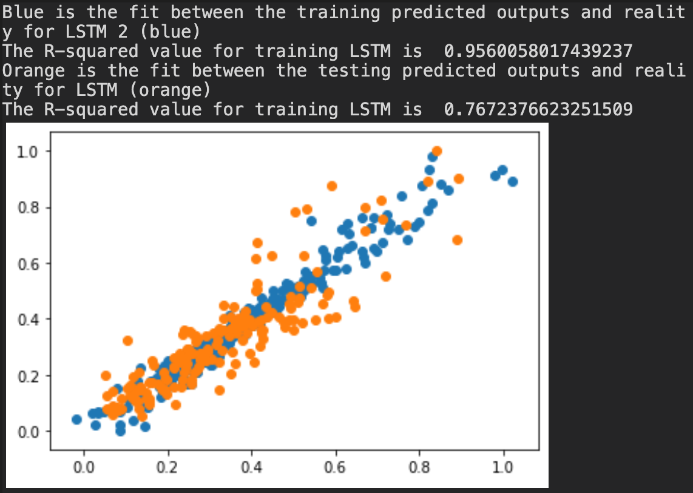

--
### Running on the cloud
Quinn Hull
Week 15
12/07/2020
--

* Overview:
  * This week I tried to harness the power of LSTM to make my predictions. I built a neural network in PyTorch with the following hyperparameters:

         # For LSTM
         num_epochs = 4000 # number of times iterating through the model
         learning_rate = 0.01 # rate of learning

         # Define rnn model
         # self.input_size = input_size # size of the inputs (i.e. 5 variables)
         ins = 3
         # self.hidden_size = hidden_size # number of cells in hidden layer
         his = 40
         # self.num_layers = num_layers # number of hidden layers (=1)
         nlay = 1
         # self.class_size = class_size # size of the extra hidden linear layer (I think this is number of layers...
         cs = 1
         # drop_out rate (to prevent over fitting)
         do = 0.5
         # type of neural network (lstm)
         rt = 'lstm'

         # Define optimization function
         optimizer = torch.optim.Adam(model.parameters(), lr=learning_rate)   # optimize all rnn parameters
         # Define loss function
         loss_func = nn.MSELoss()

  * consult the code (lines  640 - 690) for more details on the structure. This neural network actually uses a dropout method to prevent over-fitting and has an extra convolutional layer below the LSTM network that helps with filtering the data.
  * Here's a little figure showing the fit between predicted outputs and reality in training and testing. The r^2 (0.95) is much larger than that of the equivalent autoregression model (0.83). And it does pretty well with the test data, too (r^2 = 0.77)

   

   * Ultimately, I used the LSTM model to make the two-week prediction, and the autoregression method (just one week of lag) to make the seasonal prediction. (Note that it wasn't very good!)

1. What resources did you request on Ocelote? How long did you wait in the queue for your job to run and how long did it take to run?
  * I actually wasn't able to get this script to run on Ocelote because PyTorch isn't the most symbiotic package. I was able to run the package on Puma. I actually ran my script on WindFall (without any issues) because I requested a full hour of time. Note that I ran my script interactively (see below) instead of requesting time via the scheduler. I did have to wait for a little while before my request came through, maybe 2-3 minutes?

2. What was the most confusing part to you about setting up and running your job on Ocelote?
  * The most confusing part of HPC, I think, is getting everything set up with the scheduler. It's really easy to accidentally make a mistake with your PBS or SLURM file and then you end up having to go through a bunch of steps to rerun your script.
  * I think that the 'interactive' sessions are a really handy way to get around this limitation. For example I can type `!srun --nodes=1 --ntasks=10 --ntasks-per-node=10 --mem-per-cpu=4GB --time=01:00:00 --job-name=interactive --gres=gpu:1 --partition=windfall --pty bash -i` into my bash to request an hour of GPU time that I can run like a normal bash session. (Note this is windfall, which might not be the best practice cuz you get kicked off easily)

3. Where else did you run the job? How did the setup compare to your run on Ocelote?
  * I built the script and ran it initially in google Colab.  https://drive.google.com/file/d/14pTFLFd4W2P5ARacIv07drXrG-9In1Rd/view?usp=sharing (That file) has some other stuff in it that I didn't include in the python script attached because of compatability issues. It was a notebook so way more interactive and user-friendly, I think.

4. What questions do you still have after doing this?
  * Even after fiddling with this script for a good period of time, I still haven't been able to utilize the GPU speed up for the PyTorch components within it. I have used GPU with simple PyTorch scripts successfully on both HPC and Colab, however. One interesting thing that came out of experimenting with that is that Colab seems to have much bigger speedups for PyTorch than HPC (20x faster). I think this has something to do with the HPC - Singularity thing going on with PyTorch. But I have only tinkered with really small datasets (ones where GPU is basically unnecessary, anyway). This difference in performance may go away with bigger datasets.
