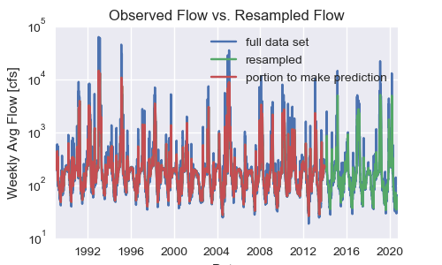
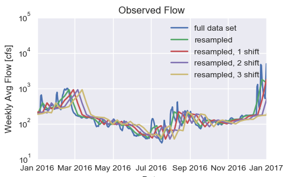
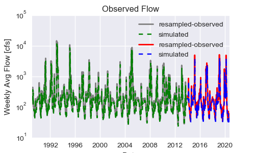
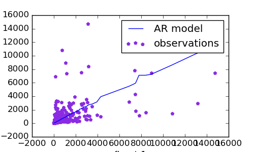
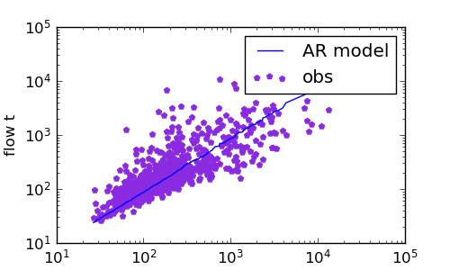

# Assignment 6
## Robert Hull
### 10022020
---------------------------------------------------------------
### Grade
3/3 - Great job nice graphs!

___
0) Review the starter code I provided to see how to build an autoregressive(AR) model.

- Things I like about this code:

  - The data pd is indexed using an integer, not date-time (which I accidentally did last time)

  - The downsample approach. I was trying to do something similar but this is a one liner

  - Adding columns with shifted data back to original dataframe

  - I need to look more closely at model.predict, but I think its reading in an array of values, and then predicting the next value (for each) value in the array.

  - Especially col that this tool can do multiple random variables

        Syntax: data.resample("W", on='datetime').mean()
        Function: resamples data weekly (W) and takes (weekly) mean
        Ref: https://pandas.pydata.org/pandas-docs/stable/reference/api/pandas.DataFrame.resample.html

        Here the two columns are shift 1, and 2 respectively
        Syntax: flow_weekly['flow_tm1'] = flow_weekly['flow'].shift(1)
        module sklearn.linear_model has a good linear regression tool
        Syntax:   from sklearn.linear_model, model = LinearRegression()


1) A summary of the AR model that you ended up building.  In your discussion please include graphical outputs that support why you made the decisions you did with your model.

* The thing I don't like about this model:
    * This model isn't great at predicting low values

* Things I mess around with
    * a. Change 3 Different Time Samples (3D, W, M)
            via data.resample
            So now there are three resampled flow datasets - for 3-days, weekly, and monthly
    * b. Create longer shifts (Add to 3)
    * c. Adjust the train and test portions, to incorporate more 'drought' data into 'train' series
        After some 'sensitivity' analysis, I found that:
            In general the 3-day running average was a poor predictor of the following three day period
            In general, shifts > 1 were poor predictors. The longer the time period (month, day, week), the poorer the prediction
            Extending the length of the 'train' period' yielded better fits
    * d. Experiment to see which types of regressions gives best fit.
        Decided to do a logarithmic regression including the first, second, and third time shifts for weekly data only
    * e. Use built-in multiple regression using sklearn
    * f. Made the graphs 'look different'

    

    

    

    a) what you are using as your prediction variables?

        * My prediction variables are flow shifted 1, 2, and 3 weeks

    b) the final equation for your model

        ```
        {

        model2 = LinearRegression() # from sklearn.linear_model
        x2=np.log(train[['flow_tm1','flow_tm2', 'flow_tm3']])
        y= np.log(train['flow'].values)
        model2.fit(x2,y)
        r_sq = model2.score(x2, y)
        print('coefficient of determination:', np.round(r_sq,2))
        print('intercept:', np.round(model2.intercept_, 2))
        print('slope:', np.round(model2.coef_, 2))

        q_pred_train = model2.predict(train[['flow_tm1','flow_tm2','flow_tm3']])
        q_pred_test = model2.predict(test[['flow_tm1','flow_tm2','flow_tm3']])

        }
        ```

    c) what you used as your testing and training periods.


              train - beginning through 2014-12-30 (time steps 0 through 1304)
              test - 2014-01-05 through present (time steps 1305 through end of file)


  


  

2) Provide an analysis of your final model performance. This should include at least one graph that shows the historical vs predicted streamflow and some discussion of qualitatively how you think your model is good or bad.

* The main innovation was using the logs of flows
* The 'train' data fits the data well, with an R^2 of nearly 0.7
        coefficient of determination: 0.69
        intercept: 0.79
        slope: [ 0.79 -0.01  0.07]

3) Finally, provide discussion on what you actually used for your forecast. Did you use your AR model, why or why not? If not how did you generate your forecast this week?
  * The short-term predictions were decent:
          [48.9012797] [42.89581168]

  * So I ended up not using the model I designed, which results in a very poor fit because the data are so low
          # array([54.        , 37.77142857, 35.        , 45.48883514, 33.41081847,
          #        30.21233972, 38.47130065, 29.53062407, 26.24714091, 32.68814316,
          #        26.10616459, 22.94783823, 27.92328735, 23.10491884, 20.19121979,
          #        23.99733032, 20.49025687])

  * I decided not to use my AR model, and instead to just use the week-averaged results from last year
              flow
          datetime
          2019-08-25	34.23
          2019-09-01	40.79
          2019-09-08	75.91
          2019-09-15	53.91
          2019-09-22	57.09
          2019-09-29	104.37
          2019-10-06	85.43
          2019-10-13	91.44
          2019-10-20	80.43
          2019-10-27	86.81
          2019-11-03	111.00
          2019-11-10	127.86
          2019-11-17	133.71
          2019-11-24	200.86
          2019-12-01	392.71
          2019-12-08	1764.57
