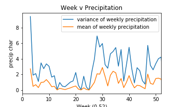
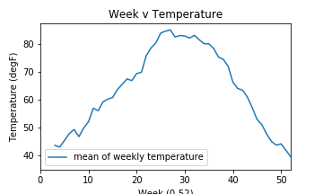
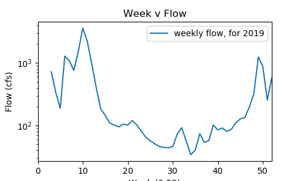

### Quinn Hull
### 10232020
### Readme for assignment 9
-----------------------
### Grade
3/3 - Excellent job!  Thanks for your help with the bug too!
____
0. IMPORTANT NOTES
  * IMPORTANT NOTE about accessing masonet datasets:
    - my token is finicky, because a user is only allowed to pull so much data before hitting paywall, which looks like the error below:

            {"SUMMARY": {"RESPONSE_CODE": 20, "RESPONSE_MESSAGE": "Account usage has exceeded the free tier. Please see https://synopticdata.com/pricing/ for more options.", "RESPONSE_TIME": "0 ms"}}

    -  a workaround is to use the string `demotoken` in place of user token (in my case `a836998da79e4faeac2bf7f5cda57a6e`)
  * running the script from terminal results in a non-fatal warning: `VisibleDeprecationWarning`. The script runs fine as written, even with these warnings.

1. A brief summary of the how you chose to generate your forecast this week.
  * I chose to use a regression approach to predict the natural log of flow that utilizes the following predictive variables:
    * 1-week-lagged natural log of flow, `'flow_tm1'`. (This is basically the approach from previous weeks).
    * year-on-year average of weekly temperature, `('air_temp_set_1', 'mean')` and
    * year-on-year standard deviation of weekly precipition, `('precip_accum_diff', 'std')`
  * Mathematically, the flow this week can be described as the following (where `m` is the model):

          `= m.intercept_ m.coef_[0] * x_lastweekflow + m.coef_[1] * x_lastweektemp + m.coef_[2] * x_lastweekprecip`
  * In words, this model uses the 'autoregression' approach used in previous weeks, while also considering week-typical weather conditions, specifically the typical temperature, and the typical variability in rainfall.
    * While the rationale for including temperature in this way is pretty self-explanatory, using the variability of rainfall allows us not only to add the typical volume of rainfall (which would be best characterized by the mean), but also the (more randomly distributed) possibility that it will or will not occur. This allows our predictions in streamflow to incorporate the possibility of random rainfall.
    * how I subsetted and transformed the raw data into these predictive variables is further described in the section called `subset and transform data`
  * Aside from incorporating these new predictive variables, I pretty much stuck to the approach from the previous HW, described at `homework-rhull21/Submissions/Code_Submission1/ReadMe.md `

  * The results look like the following, and include a description not just of the flow prediction, but also the precipitation variability and temperature used to make that prediction.

          AR Semester forecast prediction:
          Week 1: Flow (cfs) = [49.72] Precip (std)= [4.95] Temp (deg C)= [79.98] Week (int; 0 = Jan01) = 34
          Week 2: Flow (cfs) = [64.78] Precip (std)= [5.45] Temp (deg C)= [79.91] Week (int; 0 = Jan01) = 35
          Week 3: Flow (cfs) = [69.49] Precip (std)= [3.06] Temp (deg C)= [78.27] Week (int; 0 = Jan01) = 36
          Week 4: Flow (cfs) = [86.67] Precip (std)= [5.2] Temp (deg C)= [75.14] Week (int; 0 = Jan01) = 37
          Week 5: Flow (cfs) = [80.08] Precip (std)= [1.13] Temp (deg C)= [74.39] Week (int; 0 = Jan01) = 38
          Week 6: Flow (cfs) = [88.02] Precip (std)= [3.22] Temp (deg C)= [71.85] Week (int; 0 = Jan01) = 39
          Week 7: Flow (cfs) = [115.51] Precip (std)= [5.49] Temp (deg C)= [66.18] Week (int; 0 = Jan01) = 40
          Week 8: Flow (cfs) = [122.67] Precip (std)= [2.75] Temp (deg C)= [63.88] Week (int; 0 = Jan01) = 41
          Week 9: Flow (cfs) = [114.9] Precip (std)= [0.9] Temp (deg C)= [63.3] Week (int; 0 = Jan01) = 42
          Week 10: Flow (cfs) = [126.58] Precip (std)= [2.86] Temp (deg C)= [60.82] Week (int; 0 = Jan01) = 43
          Week 11: Flow (cfs) = [138.03] Precip (std)= [2.48] Temp (deg C)= [57.05] Week (int; 0 = Jan01) = 44
          Week 12: Flow (cfs) = [141.48] Precip (std)= [1.19] Temp (deg C)= [52.83] Week (int; 0 = Jan01) = 45
          Week 13: Flow (cfs) = [142.77] Precip (std)= [0.75] Temp (deg C)= [50.92] Week (int; 0 = Jan01) = 46
          Week 14: Flow (cfs) = [203.92] Precip (std)= [5.73] Temp (deg C)= [47.56] Week (int; 0 = Jan01) = 47
          Week 15: Flow (cfs) = [234.59] Precip (std)= [3.15] Temp (deg C)= [44.89] Week (int; 0 = Jan01) = 48
          Week 16: Flow (cfs) = [255.88] Precip (std)= [2.59] Temp (deg C)= [43.56] Week (int; 0 = Jan01) = 49

2. A description of the dataset you added
    * I chose to access data from masonet (https://api.synopticdata.com/v2/stations/) via api
    * I pulled data from the 5 stations nearest to our gaging station, and decided to use the precipitation and temperature data from the one station that was both closest and had the best collection of recent data (QVDA3)
    * I used a modified approach to access this data from the demo script. I concatenated a 'base' url, with an apiString that was assembled from a dictionary of arguments using the urlib module.
    * The modifications:
      - created a function to do this (because I have several api calls)
      - the response choked on ascii commas, so I replaced with normal commas

3. A plot of your additional time series along with your streamflow time series.

  * The following figures are
    * year-on-year average and standard deviation of weekly precipition

      

    * year-on-year average of weekly temperature

      

    * 1-week-lagged flow over 52 weeks in 2019

      
