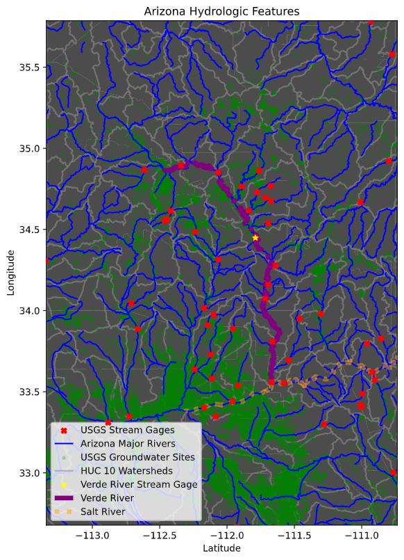
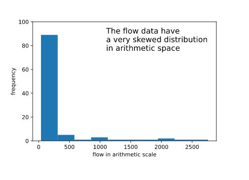
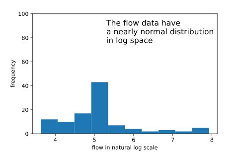

## Group name: Ol' Dell for the Win?
## Team members:
### Quinn Hull, Alexa Marcovecchio, Abigail Kahler

### Week 1 Forecast:  cfs

### Week 2 forecast:  cfs

#### Summary of collaboration:
*What did each team member bring to the table,\
who did what, and how did you decide how to combine things?*

Our group worked well together, with Quinn offering his as the source\
code, Alexa providing her 16 week forecast code, and Abigail exploring computer\
issues while improving her two-week forecast. We worked individually on\
sections of code and then coordinated their
combination.\
Abigail collaborated on the two-week forecast, the ReadMe documentation, and\
compiled functions into a separate script, Alexa provided the 16 week\
forecast, building upon her previous code by creating loops and a\
function, and Quinn created the multilayered map and the plots, and\
shared suggestions for code improvement while also facilitating\
communication and coordination of our efforts.

#### Summary of forecast:
*This should be written as a narrative summary without any blocks of code.\
It should summarize the inputs and approach used and must include at\
least 1 map and one graph.*\
\
Our approach was to center our forecast around Quinn's method of using the\
natural log of flow. \
To date, this has given better results than the other processes we have tried. \
We also adopted a "divide and conquer" distribution of work to minimize \
conflicting updates to the shared repository.

Our code utilizes functions that are stored in a separate file. The\
first, *getForecastDates()*, creates a data frame of forecast dates\
from csv files, with columns separating start and end dates by year,\
month, and day. Another, *forecast*, is specific to the two-week\
forecast with an input of the beginning flow value. The map function,\
*add_pt_gdf*, reads in a numpy array of one or multiple spatial data\
values and is used to convert this into a geopandas data frame which is\
then appended to an existing data frame. The final function,\
*investigate_gdp*, reads in a geodataframe and outputs print statements\
identifying relevant attributes.\
\
### Figures:

The map consists of 8 layers, including the USGS stream gages and groundwater sites, \
USA rivers and streams from ESRI, HUC10 watershed boundaries, and a census map \
of the state of Arizona.

Centered on the Verde River, it provides perspective on tributaries and relevance \
of other stream gages with respect to the river.
\
\
The figures provided below illustrate the distribution of flow data in both \
arithmetic and logarithmic form, supporting our decision to use log data.

